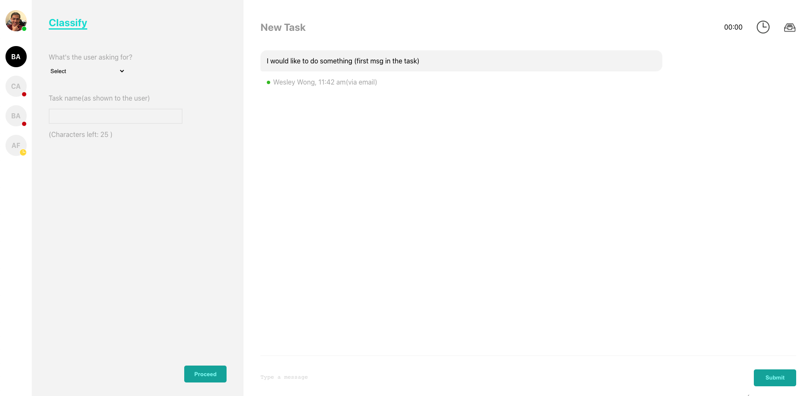

# <a href="https://wesley16838.github.io/stuff_assessment/" target="_blank">stuff_assessment</a>

> Stuff_assessment

> A ticketing system

[](https://www.npmjs.com/package/if-node-version)
[](https://www.npmjs.com/package/if-node-version)
[](https://travis-ci.org/mysticatea/if-node-version)

[]()

- The left panel contains the tickets that are assigned to the user, the black
  one is the selected ticket that the user is working on, the ticket with a red
  dot is the ticket that has a new message, and the ticket with a yellow dot is
  the one you snoozed it.
- On the gray panel (Classify panel): the user has to give a name to that
  ticket from the provided text field with characters counter beneath it. The
  maximum number of characters is 25.
- While you are typing in the text field, the characters’ counter will start
  counting down by the current text length. If the counter is less than 0, view
  it as a negative number with red color and disable the proceed button.
  Besides, the Proceed button will be enabled just if there is a selected goal
  from the list and text inside the input. Title and goal fields have to be
  stored in the relevant object attributes.
- In the white panel, the conversation box (at the bottom) will be disabled at
  the first and will be enabled only after saving the goal and title of the ticket.
  When you press on the enabled conversation box, enlarge it to an
  appropriate size (use your design skills). Clicking on the “Send” button
  should remove the text from the conversation input.

---

## Table of Contents

- [Installation](#installation)
- [Features](#features)
- [Team](#team)
- [License](#license)

---

## Installation

### Clone

- Clone this repo to your local machine using `https://github.com/Wesley16838/stuff_assessment.git`

### Setup

> Open the terminal in the Visual Studio
> and run the code in the terminal as follows:

```shell
$ npm i
$ npm start
```

> Open [http://localhost:3000](http://localhost:3000) to view it in the browser.

---

---

## License

- **[MIT license](http://opensource.org/licenses/mit-license.php)**
